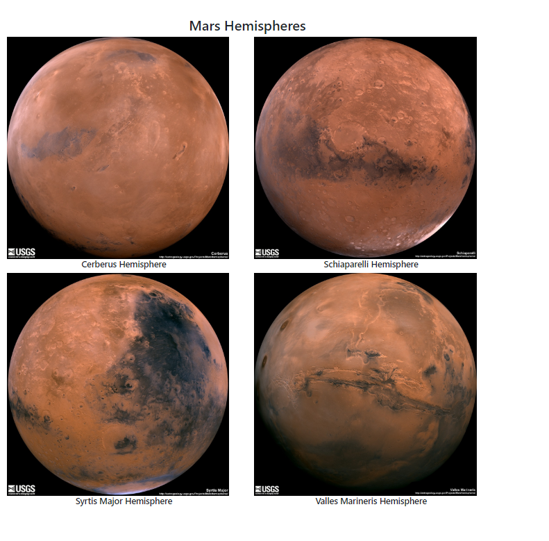

# Mission to Mars
Web Scraping - Mission to Mars

For this project Ibuild a web application that scrapes various websites for data related to the Mission to Mars and displays the information in a single HTML page.

## Applied Technologies
- Python
- Flask
- HTML/CSS
- BeautifulSoup
- scikit-learn
- keras

## Some Visualizations

