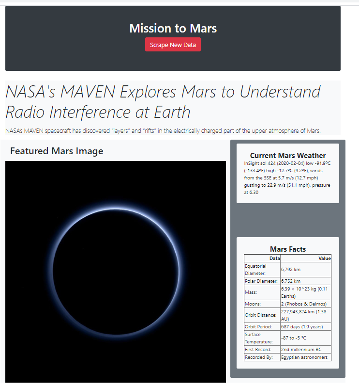

# Mission to Mars
Web Scraping - Mission to Mars

For this project I build a web application that scrapes various websites for data related to the Mission to Mars and displays the information in a single HTML page.

### Applied Technologies
- Python
- Flask
- HTML/CSS
- BeautifulSoup

## Steps
* Step 1 - Scraping
  - Wesbsites scraped : 
  [NASA Mars News Site](https://mars.nasa.gov/news/) 
  [JPL Mars Space Images](https://www.jpl.nasa.gov/spaceimages/?search=&category=Mars) 
  [Mars Weather](https://twitter.com/marswxreport?lang=en) 
  [Mars Facts](https://space-facts.com/mars/) 
  [Mars Hemispheres](https://astrogeology.usgs.gov/search/results?q=hemisphere+enhanced&k1=target&v1=Mars) 

* Step 2 - MongoDB and Flask Application
  - Used MongoDB with Flask to create a new HTML page that displays all of the information that was scraped from the URLs above.

## Some Visualizations

